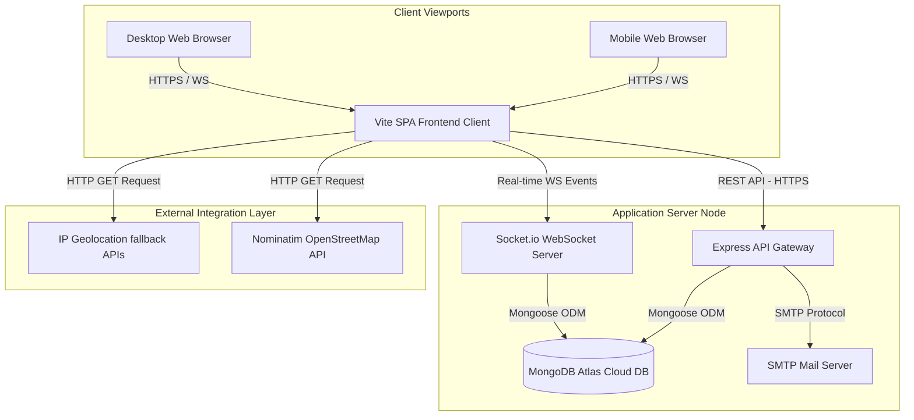
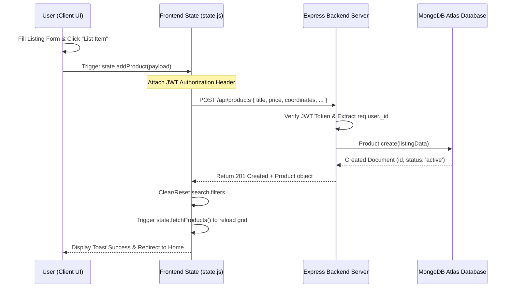
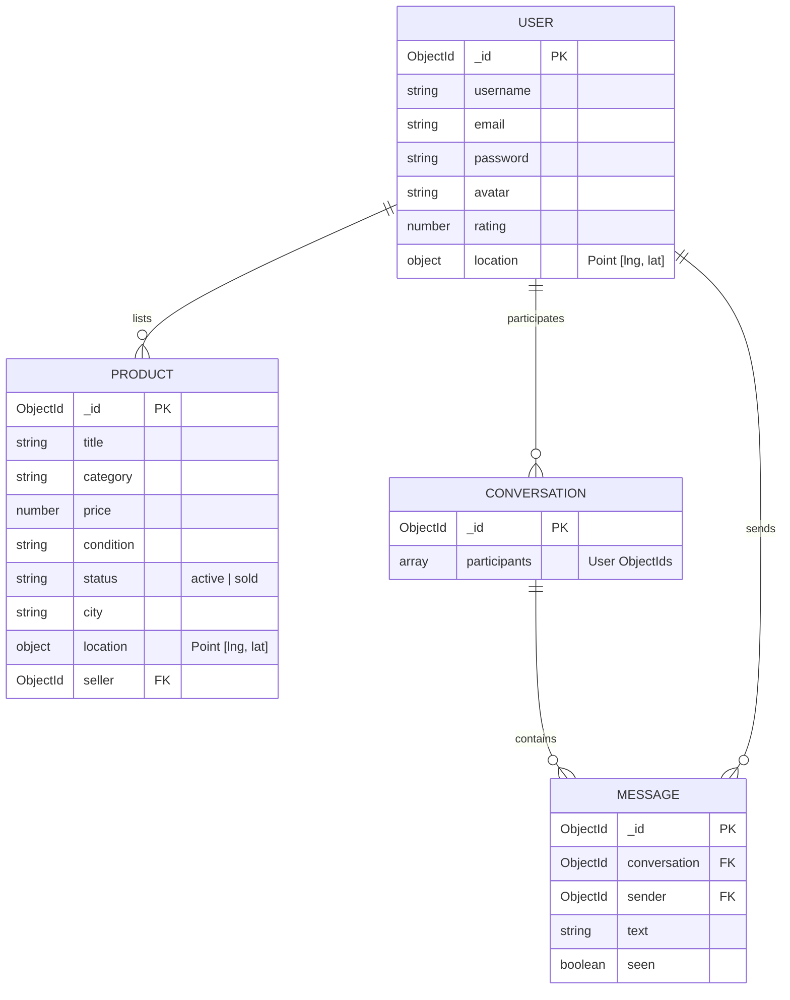

# ReUseHub Project Documentation & Technical Architecture Manual

This manual serves as a comprehensive technical guide for ReUseHub, a responsive, location-based used items marketplace. It follows best practices in software architecture documentation (adapted from the **arc42** template) to provide developers and system administrators with a complete understanding of how the system is inventory-managed, structured, and executed.

---

## 📋 1. Project Inventory

The codebase is structured as a monorepo containing distinct `/Frontend` and `/Backend` application structures. Below is the inventory of services and modules:

| **Repository/Module** | **Responsibility** | **Tech Stack** | **Current Owner** |
| :--- | :--- | :--- | :--- |
| **`/Frontend`** | Single Page Web App (SPA) UI client, routing, views, reactive client state, geolocations, and WebSockets. | Vanilla JS, Tailwind CSS v4, Lucide Icons, Socket.io Client, Vite | Frontend Team (Raushan) |
| **`/Backend`** | Express REST API gateway, Mongoose schema models, JWT auth token validation, Nodemailer mailing, and Socket.io socket server. | Node.js, Express, Mongoose, Socket.io, Nodemailer, dotenv | Backend Team (Raushan) |
| **`/Backend/models`** | Object Data Modeling (ODM) definitions mapping to MongoDB database collections. | JavaScript, Mongoose | DB Admin / Backend Team |
| **`/Backend/controllers`**| Handles API business actions (products proximity queries, chat seen receipt toggling, auth session keys). | Node.js, Express, Mongoose | Backend Team |
| **`/Backend/socket`** | Manages persistent WebSocket connection rooms, typing indications, and real-time messaging. | JavaScript, Socket.io | Backend Team |
| **`/Backend/utils`** | Shared utilities for SMTP email transporter configs and schema migrations. | JavaScript, Nodemailer | Backend Team |

---

## 🏗️ 2. Architecture & System Context Diagrams

### High-Level System Architecture (C4 Container View)
The following Mermaid diagram displays the architecture flow. Users connect through HTTPS to the Frontend (Vite SPA) and communicate with the Backend API (Express) and WebSockets (Socket.io) dynamically.



### Order Placement / Listing Creation Lifecycle (Sequence Diagram)
This diagram illustrates the sequence of operations that happen when a user uploads a new product listing for sale:



---

## 🔌 3. API Contracts & Examples

All REST API endpoints are prefix-registered under `/api`. Below are the active API contracts:

### 🔑 Authentication Endpoints (`/api/auth`)

| Method | Endpoint | Description | Auth Required | Request payload (JSON) | Response Format (200 / 201) | Error Codes |
| :--- | :--- | :--- | :--- | :--- | :--- | :--- |
| `POST` | `/api/auth/register` | Register a new user profile. | No | `{"username": "kunal", "email": "kunal@test.com", "password": "securepwd123"}` | `{"id": "6a3fa...", "username": "kunal", "email": "kunal@test.com"}` | `400` (User already exists) |
| `POST` | `/api/auth/login` | Login and fetch auth token. | No | `{"email": "kunal@test.com", "password": "securepwd123"}` | `{"token": "eyJhb...", "user": {"id": "6a...", "username": "kunal"}}` | `401` (Invalid credentials) |
| `PUT` | `/api/auth/location` | Sync user's geocoded location. | Yes (JWT) | `{"city": "Patna", "state": "Bihar", "coordinates": [85.13, 25.59]}` | `{"message": "Location updated successfully"}` | `401` (Unauthorized) |

---

### 📦 Product & Listing Endpoints (`/api/products`)

| Method | Endpoint | Description | Auth Required | Request Parameters | Response Format (200 / 201) | Error Codes |
| :--- | :--- | :--- | :--- | :--- | :--- | :--- |
| `GET` | `/api/products` | Query products list (supports search, price, condition filters). Sorted by distance if coordinates are passed. | No | Query: `latitude`, `longitude`, `search`, `category`, `condition` | `[{"id": "123", "title": "MacBook", "price": 199985, "location": "Patna", ...}]` | `500` (Server Error) |
| `POST` | `/api/products` | Create a new listing. | Yes (JWT) | Body: `title`, `category`, `price`, `condition`, `description`, `city`, `latitude`, `longitude` | `{"id": "123", "title": "MacBook", "status": "active"}` | `400` (Missing fields) |
| `PUT` | `/api/products/:id` | Update product listing details. | Yes (JWT) | Body: Same fields as POST | `{"id": "123", "title": "Updated Title"}` | `404` (Not found) |
| `DELETE` | `/api/products/:id` | Remove a product listing. | Yes (JWT) | Path param: `id` | `{"message": "Product listing deleted successfully"}` | `403` (Not owner) |

---

### 💬 Chat & Conversation Endpoints (`/api/chat`)

| Method | Endpoint | Description | Auth Required | Request parameters / Body | Response Format (200) | Error Codes |
| :--- | :--- | :--- | :--- | :--- | :--- | :--- |
| `GET` | `/api/chat/conversations` | Retrieve logged-in user's active inbox list. | Yes (JWT) | None | `[{"_id": "conv123", "participants": [...], "lastMessage": {...}}]` | `401` (Unauthorized) |
| `POST` | `/api/chat/conversations` | Initialize a new message chat room. | Yes (JWT) | Body: `{"sellerId": "seller6a..."}` | `{"_id": "conv123", "participants": [...]}` | `400` (Invalid seller ID) |
| `PUT` | `/api/chat/conversations/:id/read`| Mark incoming messages in room as read/seen. | Yes (JWT) | Path param: `id` (conversation ID) | `{"success": true}` | `404` (Chat not found) |
| `GET` | `/api/chat/unread-count` | Retrieve global unread messages count. | Yes (JWT) | None | `{"count": 2}` | `401` (Unauthorized) |

---

## ⚙️ 4. Core Business Logic & Algorithms

### 1. Geospatial Distance Formula (Haversine Algorithm)
To display proximity tags directly on the product cards (e.g. `2.5 km away`), the frontend client implements the **Haversine formula** inside [ProductCard.js](file:///C:/Users/ratho/OneDrive/Desktop/ReUseMe/Frontend/src/components/ProductCard.js#L17-L43):
```javascript
const R = 6371; // Earth's radius in kilometers
const dLat = (lat2 - lat1) * Math.PI / 180;
const dLon = (lon2 - lon1) * Math.PI / 180;
const a = 
  Math.sin(dLat/2) * Math.sin(dLat/2) +
  Math.cos(lat1 * Math.PI / 180) * Math.cos(lat2 * Math.PI / 180) * 
  Math.sin(dLon/2) * Math.sin(dLon/2);
const c = 2 * Math.atan2(Math.sqrt(a), Math.sqrt(1-a));
const distance = R * c; // Resulting distance in km
```
* **Time Complexity**: $\mathcal{O}(1)$ constant calculation time.
* **Space Complexity**: $\mathcal{O}(1)$ auxiliary space.

### 2. Startup Location Resolution Algorithm
The frontend initialization implements a non-blocking caching pipeline to resolve geolocations:
1. **Cache Read**: Attempts to fetch cached coordinates from `localStorage.getItem('detectedLocation')`.
2. **Immediate API Wake-up**: Parallelizes a products query immediately using the cached or default coordinates (`Patna, Bihar` `[85.1376, 25.5941]`). This fires queries to Render free tier early to spin up cold containers.
3. **Background GPS/IP Resolution**: If `force === true` (manually chosen) or no cache exists:
   * Requests browser GPS coords via `navigator.geolocation.getCurrentPosition()`.
   * On failure, falls back to IP location APIs (`ipapi.co` and `ip-api.com`).
   * Calls Nominatim OpenStreetMap reverse geocoding API to resolve coords to city names.
   * Strips complex administrative characters (e.g., `Jharia-Cum-Jorapokhar-Cum-Sindri` becomes `Jharia`).
   * Saves to cache and updates the UI grid.

### 3. Read Receipt & Seen Ticks Workflow
The socket server tracks online connections inside `userSocketMap`.
* **Ticks Escalation**:
  * If the receiver is disconnected, the message is stored with `seen: false` in the database. The sender sees a single check mark `✓`.
  * If the receiver is connected to the socket server, the backend emits `receive-message` to the receiver and immediately marks the delivery, shifting checkmarks to double-gray `✓✓` in the sender's UI.
  * When the receiver opens the chat window, the client emits `message-seen` via WS. The server performs an update:
    ```javascript
    await Message.updateMany({ conversation, sender, seen: false }, { $set: { seen: true } });
    ```
    And broadcasts a `messages-marked-seen` event to the sender, triggering blue double checks `✓✓` in the UI.

---

## 🗄️ 5. Data Models & Schema Migrations

### Database Schema (ER Diagram)
The database structure contains four main MongoDB collections modeled with Mongoose:



### Schema Index Specifications
* **Product Collection Index**: A `2dsphere` index is configured on the `location` field to support high-performance geospatial `$near` queries.
  ```javascript
  productSchema.index({ location: '2dsphere' });
  ```
* **User Collection Index**: An `email` field index configured with `unique: true` to prevent duplicate registration.

### Database Clean-Up Migration Script
To prevent geospatial sorting crashes from legacy or manual DB records lacking location indices, the backend automatically runs a schema migration at startup inside `app.js` (lines 60-114):
* Identifies users and products missing `location.coordinates` array shapes.
* Sets fallback defaults (`[0,0]` for users, `[85.1376, 25.5941]` for products).
* Runs Mongoose `syncIndexes()` to rebuild indices.

---

## 🛡️ 6. Security and Authentication

### 1. Password Hashing (Blowfish Cryptography)
User passwords are encrypted before storing in the database inside `Backend/models/User.js` using `bcryptjs`:
* **Hashing process**: Generates a salt factor of `10` rounds and computes a secure salt hash.
* **Verification process**: Uses `bcrypt.compare()` to match raw login inputs against database encrypted secrets.

### 2. JSON Web Token (JWT) Verification Middleware
Protected endpoints require passing an `Authorization: Bearer <token>` HTTP header:
* Checks token presence, splits the Bearer schema prefix, and decrypts the signature using `jwt.verify(token, JWT_SECRET)`.
* Appends decrypted user records directly to the request context: `req.user = user`.

### 3. Rate Limiting & CORS Configuration
* **CORS Whitelist**: Whitelists local developer contexts (`localhost`, `127.0.0.1`) and the production frontend (`https://reuseme-eight.vercel.app`), blocking unauthorized cross-origin requests.
* **Payload Limits**: Limits JSON body payloads to `10mb` to protect the backend from Denial-of-Service (DoS) buffer overflows during image uploads.

---

## 🧪 7. Testing Strategy

The project utilizes local functional verification and manual E2E validation flows:

### 1. Functional Verification Scripts (`/scratch`)
* **`/scratch/test_registration.js`**: Automatically tests registration, email dispatches, and login operations.
* **`/scratch/test_chat_endpoints.js`**: Mimics multi-user handshakes, logging users in and posting messages to test WebSocket delivery.

### 2. Manual Walkthrough Checklist
* Verify dark/light toggle behaves correctly across the website.
* Open developers console, block browser location prompt, and verify that IP geocoding falls back automatically without errors.
* Upload a mock item on `http://localhost:5173/#/sell`, then check the home page grid to verify the listing card renders.

---

## 🚢 8. CI/CD Pipelines & Deployment

### Frontend Deployment (Vercel)
* Connected directly to the main Git repository branch.
* **Build Command**: `vite build`
* **Output Directory**: `dist`
* **Routing Override**: Configured with a `vercel.json` rewrite file directing all path calls to `index.html` to support hash routing natively.

### Backend Deployment (Render)
* Hosted on Render web services.
* **Build Command**: `npm install --prefix Backend`
* **Start Command**: `node Backend/app.js`
* **Environment variables**: Configured with production values for `MONGODB_URI`, `JWT_SECRET`, `EMAIL_USER`, and `EMAIL_PASS`.

---

## 📊 9. Observability & Logging

### Console Logger
The application uses standard node streams to log critical events. Below is the log format schema:
* **Server Start Logs**:
  ```
  Connected to MongoDB database successfully.
  ✅ SMTP Ready
  Database indexes synchronized successfully.
  Express API Server running on port 3001
  ```
* **WebSocket Client Connection Logs**:
  ```
  Socket connected: User 6a3fa0165bf627cf0928867c (Socket: QwErTyUiOp)
  Socket QwErTyUiOp joined room: 6a464b615ed832d08cd7e6cf
  ```

---

## 🛠️ 10. Common Debugging Workflows

### Scenario: Port 3001 Blocked (`EADDRINUSE`)
If a previous execution didn't close cleanly, port `3001` remains locked, crashing nodemon:
```
Error: listen EADDRINUSE: address already in use :::3001
```

#### Diagnostic Flow:
1. **Find blocking process PID**:
   * Windows (PowerShell):
     ```powershell
     Get-Process -Id (Get-NetTCPConnection -LocalPort 3001).OwningProcess
     ```
   * Linux/macOS (Terminal):
     ```bash
     lsof -i :3001
     ```
2. **Force-kill process**:
   * Windows:
     ```powershell
     Stop-Process -Id <PID> -Force
     ```
   * Linux/macOS:
     ```bash
     kill -9 <PID>
     ```

---

## 🏁 11. Developer Onboarding Checklist

Follow this checklist to set up your local development environment:

1. **Clone Repository**:
   ```bash
   git clone <repo-url> ReUseMe
   cd ReUseMe
   ```
2. **Install Dependencies**:
   ```bash
   npm run install-all
   ```
3. **Environment Setup**:
   Create a `.env` file inside `/Backend` folder with these keys:
   ```env
   PORT=3001
   MONGODB_URI=mongodb+srv://<user>:<password>@cluster.mongodb.net/reuseme
   JWT_SECRET=supersecretkey
   EMAIL_USER=your_email@gmail.com
   EMAIL_PASS=smtp_app_password
   ```
4. **Launch Local Servers**:
   ```bash
   npm start
   ```
5. **Verify**:
   * Open `http://localhost:5173/` in your browser.
   * Access API checks at `http://localhost:3001/api/products`.

---

## 💬 12. Interview Q&A Preparation Examples

### Core Architecture & State
* **Q: Explain the global state management on the frontend and why it was chosen over React/Redux.**
* **A**: "We chose a lightweight, vanilla JS publisher-subscriber (Pub/Sub) pattern in `state.js` instead of React or Redux. This keeps the application load speed extremely fast by avoiding framework overhead. Since the app is built on custom template literal renderers, components simply subscribe to changes in the central `state` object. When state changes, we call `notify()`, which redraws active views. This reduces bundle size to almost zero framework code."

---

### Geospatial Listing Sorting
* **Q: How does the location proximity product matching logic work, and how is it optimized for performance?**
* **A**: "On the backend, products are saved with a GeoJSON Point `[longitude, latitude]`. We built a MongoDB `2dsphere` index on this field. When querying `GET /api/products`, we pass coords to MongoDB's `$near` query operator, which resolves sorted listings automatically. To optimize load speed, we cache geocoded user locations in `localStorage` so we don't block the main thread waiting for browser GPS or third-party reverse geocoding API calls on subsequent page visits."

---

### WebSockets & Read Receipts
* **Q: How did you implement read receipts (seen checkmarks) in the real-time chat, and how did you resolve write latency issues?**
* **A**: "The Socket.io server maps user IDs to active socket connections. When a message is sent, we write it to MongoDB and emit the payload to the recipient. When the recipient opens the chat window, a `message-seen` event triggers a bulk `updateMany` request in the database to mark messages as read. To bypass database write latency race conditions where the unread badges were synced before updates finished, we introduced a 200ms delay to client unread counts queries, ensuring correct totals are always returned."
